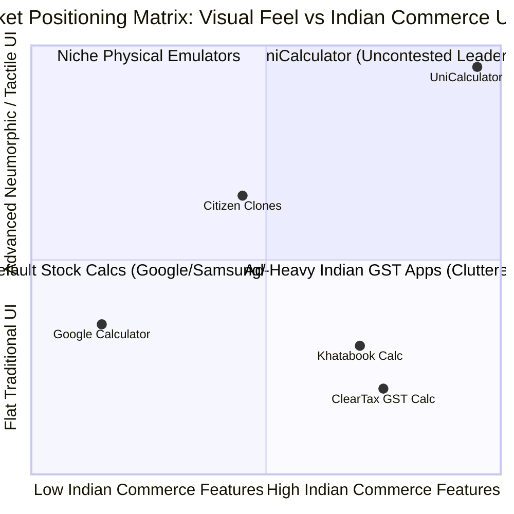

# 🎯 02. PRODUCT STRATEGY & MARKET POSITIONING
**Project**: UniCalculator (Bharat Pro Financial & GST Neumorphic Calculator)

---

## 1. Market Opportunity in India (FinTech & Utility Landscape)
- **Target TAM (Total Addressable Market)**: 63+ Million MSMEs (Micro, Small & Medium Enterprises) in India, 12+ Million GST registered businesses, 300+ Million daily smartphone users engaged in commerce, trading, and retail shopping.
- **SAM (Serviceable Addressable Market)**: Tier 1 to Tier 3 retail merchants, Kirana owners, Chartered Accountant interns, freelance billing professionals, and student shoppers searching for clean, ad-free financial utility apps.
- **SOM (Serviceable Obtainable Market)**: 5 Million active Indian users seeking a dedicated physical-like Neumorphic GST & Cash Tally daily companion.

---

## 2. Competitive Moat & Positioning Map

### Strategic Moat Pillars:
1. **The Neumorphic Aesthetic Hook**: Outstanding visual differentiation in a sea of bland, flat, template calculators. The tactile soft-3D buttons create instant viral appeal on social media, YouTube Tech reviews, and Reddit.
2. **Zero Inaccuracies Guarantee**: Utilizing `BigDecimal` Banker's Rounding (`RoundingMode.HALF_EVEN`) ensures that every invoice, GST filing, and cash tally matches official Indian banking guidelines down to the exact paisa (`₹0.01`).
3. **Hyper-Localized Bharat Commerce**: Embedding Indian GST laws (CGST/SGST/IGST), Cess rules, and RBI currency denominations directly into the primary UI without deep buried menus.
4. **Privacy-First Zero Ad Distraction**: 100% functional offline without tracking user financial transactions, building immense trust with business owners.

---

## 3. Business Model & Monetization Strategy
1. **Core Free Tier (100% Uncompromised)**:
   - Full Neumorphic Standard Calculator.
   - Full GST Forward & Reverse Engine with all standard slabs.
   - Full Cash Denomination Tally with Words Generator.
   - Local History Tape (up to last 200 calculations).
   - Zero popup ads, zero video interstitials.
2. **Pro Lifetime License / Supporter Edition (Optional ₹99 / ₹199 one-time)**:
   - Infinite History Tape with CSV & PDF branding export.
   - Custom Business Header & Logo on WhatsApp Shareable Invoices.
   - Custom Neumorphic Themes (Brushed Titanium, Vintage Cream Citizen, Cyber Obsidian Dark, Rose Gold).
   - Custom Custom GST Slabs (for specialized traders: Timber, Gold 3%, Diamonds 0.25%, Lottery 28%).

---

## 4. Key Performance Indicators (KPIs)
- **D1 Retention**: > 65%
- **D30 Retention**: > 42% (Significantly higher than average utility apps due to daily shop closing utility).
- **Average Daily Session Duration**: 3.5 minutes (Kirana daily closing + continuous billing calculations).
- **Cold App Launch Time**: < 70ms on low-end MediaTek/Snapdragon devices.
- **ANR (Application Not Responding) Rate**: < 0.001%.
