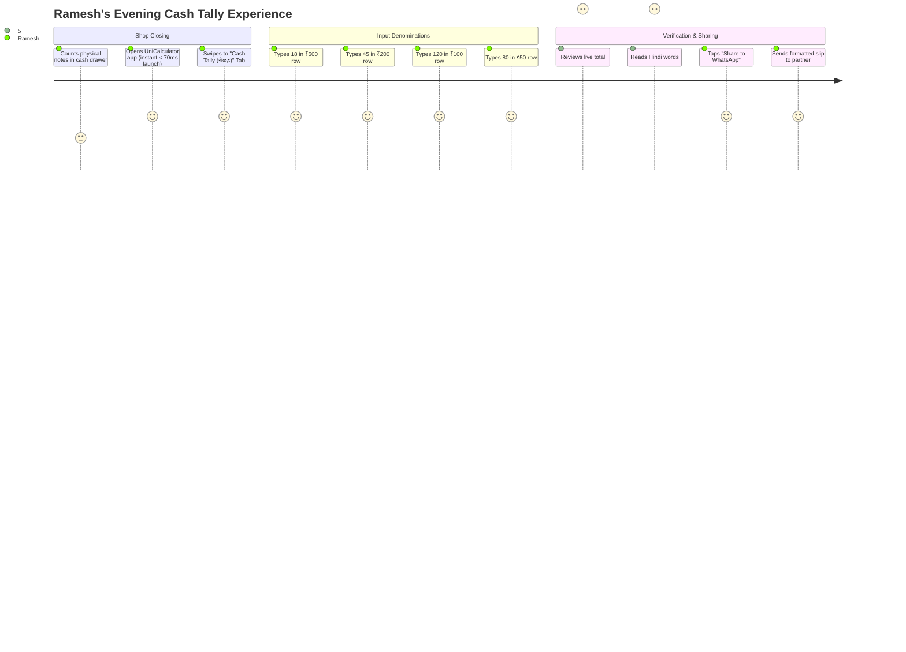
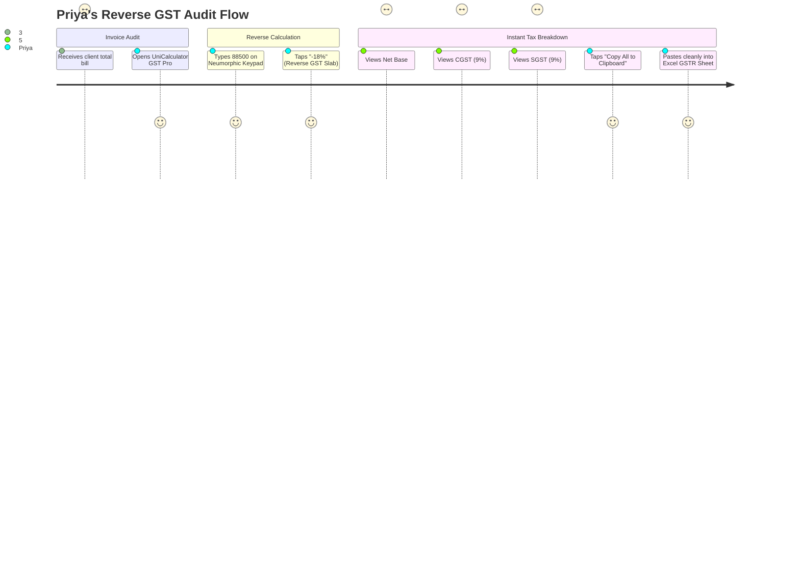
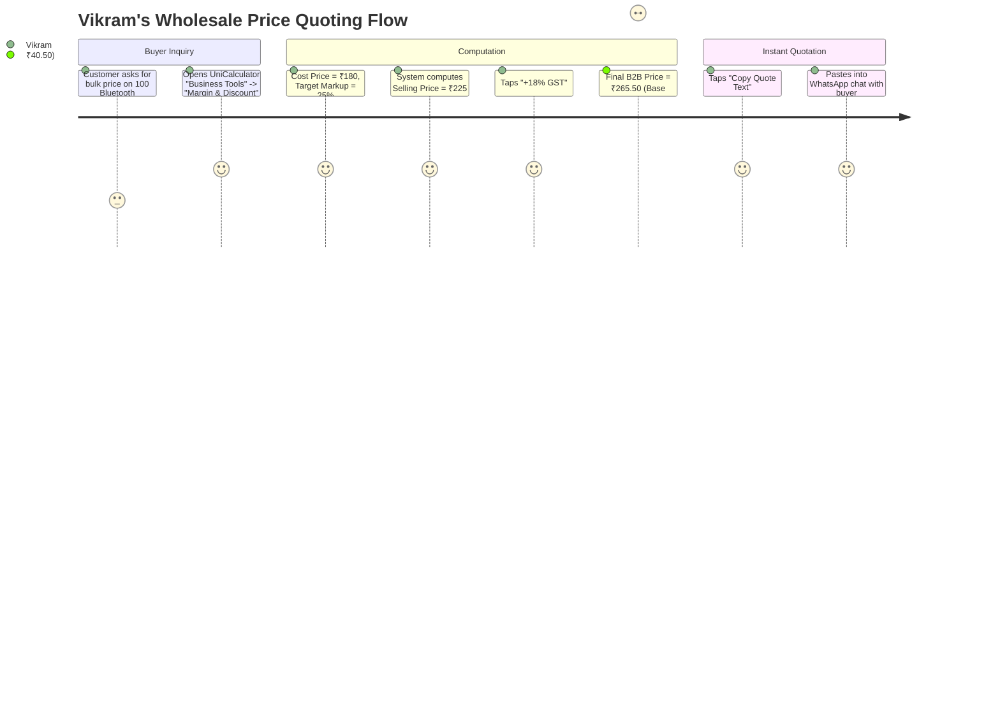

# 🗺️ 06. USER JOURNEY MAPS & EXPERIENCES
**Project**: UniCalculator (Bharat Pro Financial & GST Neumorphic Calculator)

---

## 🚀 Journey 1: Evening Kirana Store Cash Settlement (Ramesh's Journey)

### Experience Breakdown:
- **Pain Point Addressed**: Eliminates manual multiplication errors, scrap-paper misplacement, and hesitation when writing amounts in words for morning bank deposits.
- **Emotion Curve**: Starts tired at 9:30 PM ➔ Feels empowered and reassured by instant tactile feedback ➔ Ends with a sense of completion in under 25 seconds.

---

## ⚡ Journey 2: Reverse GST Invoice Verification (Priya's Journey)

### Experience Breakdown:
- **Pain Point Addressed**: Replaces a 4-step manual calculation with a single tactile tap.
- **Emotion Curve**: Stress-free audit verification, 100% confidence in exact paisa accuracy.

---

## 📈 Journey 3: Quick Wholesale B2B Quote (Vikram's Journey)

