# 🏗️ 07. INFORMATION ARCHITECTURE (IA) & TAXONOMY
**Project**: UniCalculator (Bharat Pro Financial & GST Neumorphic Calculator)

---

## 1. System Architecture Hierarchy

```mermaid
graph TD
    App[UniCalculator Pro Root]
    
    App --> Shell[Neumorphic App Shell & Navigation Suite]
    
    Shell --> Tab1[Tab 1: Standard Calc]
    Shell --> Tab2[Tab 2: GST Pro Engine]
    Shell --> Tab3[Tab 3: Cash Tally / Rokad]
    Shell --> Tab4[Tab 4: Business Tools]
    Shell --> Drawer[Persistent History Tape Drawer]
    Shell --> Settings[Settings & Personalization]

    Tab1 --> T1_Disp[Recessed Neumorphic LCD Well]
    Tab1 --> T1_Keys[Tactile Keypad Matrix 4x5]
    Tab1 --> T1_Mem[Citizen Memory Accumulator Bar]
    
    Tab2 --> T2_Disp[Dual Breakdown Display]
    Tab2 --> T2_Slabs[Neumorphic Slab Row: 0%, 5%, 12%, 18%, 28%]
    Tab2 --> T2_Tog[Intra/Inter State Jurisdictional Switch]
    Tab2 --> T2_Custom[Custom Rate & Cess Dialog]

    Tab3 --> T3_Summ[Cash Summary Card with Lakhs/Crores Words]
    Tab3 --> T3_Grid[RBI Note Denomination Stepper List]
    Tab3 --> T3_Act[WhatsApp Export & Clear Actions]

    Tab4 --> T4_Marg[Margin vs. Markup Calculator]
    Tab4 --> T4_Disc[Trade & Cash Discount Stacking]
    Tab4 --> T4_EMI[Loan EMI & Amortization]
    Tab4 --> T4_SIP[SIP & Mutual Fund Wealth Gain]

    Drawer --> D_List[Chronological Audit Log]
    Drawer --> D_Filter[Tag Filters: All, GST, Math, Cash]
    Drawer --> D_Exp[Export to PDF / CSV / Text]

    Settings --> S_Theme[Neumorphic Themes: Citizen Cream, Dark Titanium, Obsidian]
    Settings --> S_Haptics[Tactile Haptic Intensity: Soft, Mechanical, Strong, Off]
    Settings --> S_Lang[Language: English, Hindi, Hinglish, Gujarati, Marathi, etc.]
    Settings --> S_Format[Number Format: Indian Lakh/Crore vs International]
```

---

## 2. Component Taxonomy & Nomenclature
| Module Code | Component Name | Responsibility |
| :--- | :--- | :--- |
| `COMP-DISP-01` | **NeumorphicLCDWell** | Inset recessed display showing expression, live preview, and final formatted string with dynamic font auto-scaler. |
| `COMP-BTN-01` | **NeumorphicTactileKey** | Extruded convex button that smoothly transitions to an inset concave state on user press. |
| `COMP-SLAB-01` | **GSTSlabKeypad** | Dedicated row of extruded pill buttons for `+5%`, `+12%`, `+18%`, `+28%` with colored glow rings. |
| `COMP-CARD-01` | **TaxBreakdownPlate** | Elevated neumorphic plate presenting Base Amount, CGST, SGST, IGST, and Cess in clear monospaced alignment. |
| `COMP-TALLY-01`| **DenominationRow** | Interactive horizontal row with currency bill icon, face value chip, quantity input field, and live row total. |
| `COMP-TAPE-01` | **AuditTapeDrawer** | Sliding panel displaying past calculation receipts with timestamps, notes, and tap-to-restore action. |
