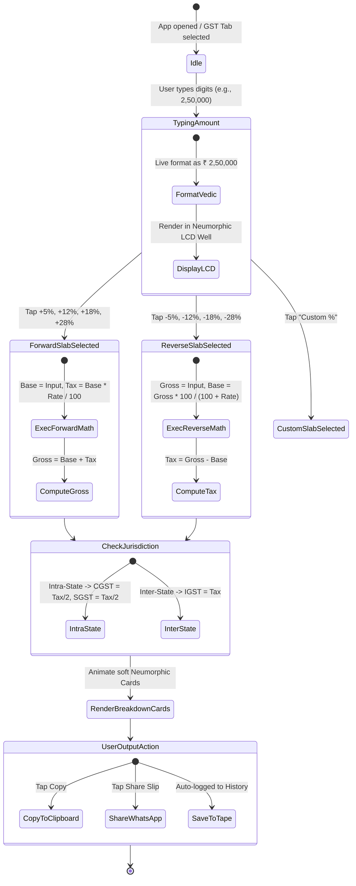
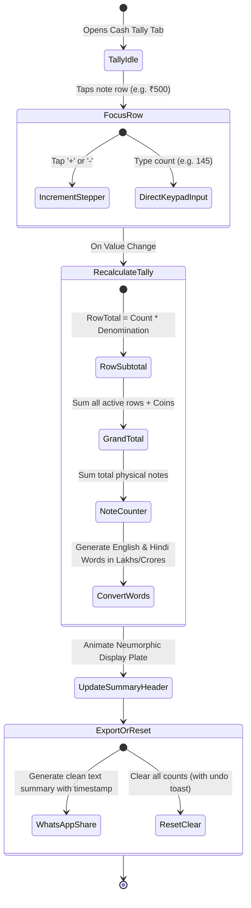

# 🔄 08. USER FLOWS & INTERACTION STATE MACHINES
**Project**: UniCalculator (Bharat Pro Financial & GST Neumorphic Calculator)

---

## 1. GST Calculation Flow (Forward & Reverse)

---

## 2. Cash Denomination Tally (Rokad) Flow

