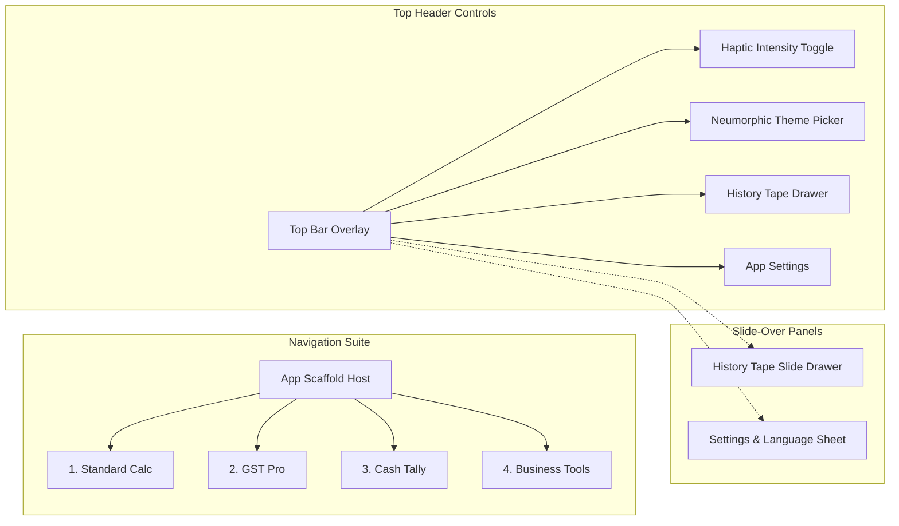

# 🧭 09. NAVIGATION STRUCTURE & SCREEN ORCHESTRATION
**Project**: UniCalculator (Bharat Pro Financial & GST Neumorphic Calculator)

---

## 1. Adaptive Navigation Architecture

UniCalculator uses a clean, responsive navigation architecture built with **Jetpack Compose Navigation Suite Scaffold**:
- **Compact Screens (Phones < 600dp)**: Persistent Bottom Navigation Bar with tactile extruded Neumorphic icons and pill indicators.
- **Medium & Expanded Screens (Foldables / Tablets > 600dp)**: Vertical Neumorphic Navigation Rail on the left edge with expanded dual-pane content viewports.



---

## 2. Screen Routing Specifications (Type-Safe Kotlin Objects)

```kotlin
// Type-safe Navigation Routes
sealed interface ScreenRoute {
    @Serializable
    data object StandardCalculator : ScreenRoute

    @Serializable
    data object GSTPro : ScreenRoute

    @Serializable
    data object CashTally : ScreenRoute

    @Serializable
    data object BusinessTools : ScreenRoute

    @Serializable
    data class InvoiceDetail(val calculationId: Long) : ScreenRoute
}
```

### Transition Choreography:
- **Tab Switching**: Horizontal slide with subtle alpha fade (`slideInHorizontally(spring()) + fadeIn()`).
- **History Drawer**: Overlapping right-to-left slide with background dimming and soft Neumorphic shadow casting on the main viewport.
- **Dialogs & Sheets**: Fluid vertical spring sheet emerging from the bottom with concave backdrop blur.
