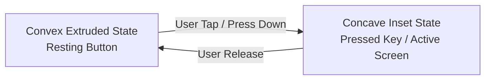

# 🎨 12. ADVANCED NEUMORPHISM DESIGN SYSTEM & ATOMIC UI
**Project**: UniCalculator (Bharat Pro Financial & GST Neumorphic Calculator)

---

## 1. Neumorphic Physics & Lighting Model

Neumorphism (Soft UI) creates a tactile, physical illusion by simulating light casting onto extruded and recessed surfaces.

### Lighting Constants:
- **Light Angle**: Top-Left ($315^\circ$ or $-45^\circ$, $dx = -6\text{dp}, dy = -6\text{dp}$).
- **Light Source Highlight**: Pure White or Soft Cyan/Amber highlight with high blur and low opacity ($30\% - 60\%$).
- **Dark Cast Shadow**: Deep ambient tint with high blur and medium opacity ($15\% - 30\%$).
- **Surface Elevation**: Continuous smoothly blended curve rather than floating cards.

```
                    LIGHT SOURCE (Sun @ -45°)
                              \
                               \
      ╭─────────────[ SOFT WHITE HIGHLIGHT ]─────────────╮
      │                                                  │
      │              EXTRUDED CONVEX BUTTON              │
      │                  (Resting State)                 │
      │                                                  │
      ╰──────────────[ DEEP DARK SHADOW ]────────────────╯
```

---

## 2. Neumorphic Surface States



1. **Extruded Convex (Resting Key)**:
   - Light shadow on Top-Left: `Offset(-6dp, -6dp)`, Blur: `12dp`, Color: `HighlightColor`
   - Dark shadow on Bottom-Right: `Offset(6dp, 6dp)`, Blur: `12dp`, Color: `ShadowColor`
2. **Pressed / Concave Inset (Pressed Key & LCD Viewport)**:
   - Inner shadow on Top-Left: Clipped inner blur from Top-Left with `ShadowColor`
   - Inner highlight on Bottom-Right: Clipped inner blur from Bottom-Right with `HighlightColor`
3. **Flat / Subtle Plate (Container & Card)**:
   - Elevation radius: `4dp`, low spread for soft backdrop separation.

---

## 3. Color Palettes & Neumorphic Themes

### Theme 1: Citizen Classic Vintage (The Merchant Choice)
- **Background Base**: `#E8E5DF` (Soft warm beige stone)
- **Light Highlight**: `#FFFFFF` (Alpha 80%)
- **Dark Shadow**: `#C2BEB5` (Alpha 90%)
- **Primary Accent (Rupee Emerald)**: `#00875A`
- **Secondary Accent (GST Amber)**: `#E67E22`
- **LCD Well Inset**: `#DCD8D0` with LCD ink `#1C2833`

### Theme 2: Dark Titanium & Obsidian (Battery Saver OLED)
- **Background Base**: `#1E2228` (Deep matte slate)
- **Light Highlight**: `#2C323B` (Alpha 90%)
- **Dark Shadow**: `#101216` (Alpha 95%)
- **Primary Accent (Cyber Neon Emerald)**: `#00E676`
- **Secondary Accent (Solar Saffron)**: `#FF9100`
- **LCD Well Inset**: `#14171B` with glowing cyan/green numerals `#E0F2F1`

---

## 4. Jetpack Compose Neumorphic Modifier Architecture

```kotlin
// Production-Ready Neumorphic Modifier in Jetpack Compose
enum class NeumorphicShape {
    CONVEX,     // Raised / Extruded (Normal button)
    CONCAVE,    // Inset / Pressed (LCD screen, pressed button)
    FLAT        // Subtle plate
}

@Stable
data class NeumorphicColors(
    val background: Color,
    val lightShadow: Color,
    val darkShadow: Color,
    val accent: Color
)

fun Modifier.neumorphic(
    shape: NeumorphicShape = NeumorphicShape.CONVEX,
    cornerRadius: Dp = 16.dp,
    elevation: Dp = 6.dp,
    lightShadowColor: Color = Color.White.copy(alpha = 0.7f),
    darkShadowColor: Color = Color.Black.copy(alpha = 0.2f)
): Modifier = this.drawBehind {
    val cornerRadiusPx = cornerRadius.toPx()
    val elevationPx = elevation.toPx()
    
    when (shape) {
        NeumorphicShape.CONVEX -> {
            // Draw Top-Left Light Highlight Shadow
            drawIntoCanvas { canvas ->
                val paint = Paint().apply {
                    color = lightShadowColor.toArgb()
                    asFrameworkPaint().maskFilter = MaskFilter(BlurMaskFilter.Blur.NORMAL, elevationPx)
                }
                canvas.drawRoundRect(
                    left = -elevationPx,
                    top = -elevationPx,
                    right = size.width - elevationPx,
                    bottom = size.height - elevationPx,
                    radiusX = cornerRadiusPx,
                    radiusY = cornerRadiusPx,
                    paint = paint
                )
            }
            // Draw Bottom-Right Dark Cast Shadow
            drawIntoCanvas { canvas ->
                val paint = Paint().apply {
                    color = darkShadowColor.toArgb()
                    asFrameworkPaint().maskFilter = MaskFilter(BlurMaskFilter.Blur.NORMAL, elevationPx)
                }
                canvas.drawRoundRect(
                    left = elevationPx,
                    top = elevationPx,
                    right = size.width + elevationPx,
                    bottom = size.height + elevationPx,
                    radiusX = cornerRadiusPx,
                    radiusY = cornerRadiusPx,
                    paint = paint
                )
            }
        }
        NeumorphicShape.CONCAVE -> {
            // Draw Inner Inset Shadows for Recessed LCD Screen / Pressed Button
            drawIntoCanvas { canvas ->
                canvas.save()
                val clipPath = Path().apply {
                    addRoundRect(RoundRect(0f, 0f, size.width, size.height, CornerRadius(cornerRadiusPx)))
                }
                canvas.clipPath(clipPath)
                
                // Top-Left Inner Dark Shadow
                val innerDarkPaint = Paint().apply {
                    color = darkShadowColor.toArgb()
                    style = PaintingStyle.Stroke
                    strokeWidth = elevationPx * 2
                    asFrameworkPaint().maskFilter = MaskFilter(BlurMaskFilter.Blur.NORMAL, elevationPx)
                }
                canvas.drawRoundRect(
                    left = -elevationPx,
                    top = -elevationPx,
                    right = size.width + elevationPx,
                    bottom = size.height + elevationPx,
                    radiusX = cornerRadiusPx,
                    radiusY = cornerRadiusPx,
                    paint = innerDarkPaint
                )
                canvas.restore()
            }
        }
        NeumorphicShape.FLAT -> {
            // Subtle plate
        }
    }
}
```
