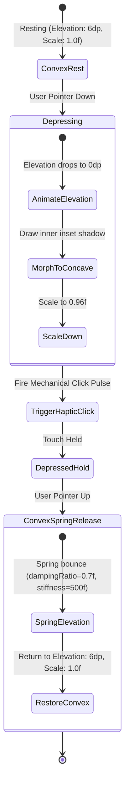

# 🕹️ 14. INTERACTION, HAPTICS & MOTION DESIGN
**Project**: UniCalculator (Bharat Pro Financial & GST Neumorphic Calculator)

---

## 1. Physics-Based Neumorphic Key Press Animation

When a user taps a Neumorphic key, it smoothly depresses into the surface, simulating the physical resistance and travel of a tactile mechanical switch:



---

## 2. Advanced Android Haptic Composition Engine

UniCalculator utilizes modern Android `Vibrator` / `VibratorManager` with rich tactile profiles:

```kotlin
class NeumorphicHapticEngine(private val context: Context) {
    private val vibrator = if (Build.VERSION.SDK_INT >= Build.VERSION_CODES.S) {
        val manager = context.getSystemService(Context.VIBRATOR_MANAGER_SERVICE) as VibratorManager
        manager.defaultVibrator
    } else {
        @Suppress("DEPRECATION")
        context.getSystemService(Context.VIBRATOR_SERVICE) as Vibrator
    }

    fun playKeyClick() {
        if (Build.VERSION.SDK_INT >= Build.VERSION_CODES.R) {
            val effect = VibrationEffect.startComposition()
                .addPrimitive(VibrationEffect.Composition.PRIMITIVE_CLICK, 0.6f)
                .compose()
            vibrator.vibrate(effect)
        } else {
            vibrator.vibrate(VibrationEffect.createOneShot(10, VibrationEffect.DEFAULT_AMPLITUDE))
        }
    }

    fun playOperatorTick() {
        if (Build.VERSION.SDK_INT >= Build.VERSION_CODES.R) {
            val effect = VibrationEffect.startComposition()
                .addPrimitive(VibrationEffect.Composition.PRIMITIVE_TICK, 0.8f)
                .compose()
            vibrator.vibrate(effect)
        }
    }

    fun playGSTSlabPop() {
        if (Build.VERSION.SDK_INT >= Build.VERSION_CODES.R) {
            val effect = VibrationEffect.startComposition()
                .addPrimitive(VibrationEffect.Composition.PRIMITIVE_LOW_TICK, 0.7f)
                .addPrimitive(VibrationEffect.Composition.PRIMITIVE_QUICK_FALL, 0.5f, 20)
                .compose()
            vibrator.vibrate(effect)
        }
    }

    fun playClearBurst() {
        if (Build.VERSION.SDK_INT >= Build.VERSION_CODES.R) {
            val effect = VibrationEffect.startComposition()
                .addPrimitive(VibrationEffect.Composition.PRIMITIVE_SPIN, 0.9f)
                .compose()
            vibrator.vibrate(effect)
        }
    }
}
```
