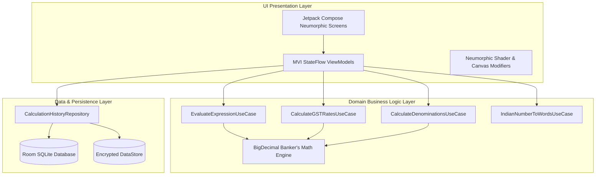

# ⚙️ 16. TECHNICAL ARCHITECTURE & DATA DESIGN
**Project**: UniCalculator (Bharat Pro Financial & GST Neumorphic Calculator)

---

## 1. Clean Hexagonal Architecture Overview



---

## 2. Zero-Loss `BigDecimal` Financial Math Engine

```kotlin
package com.unicalculator.core.domain.engine

import java.math.BigDecimal
import java.math.RoundingMode

data class TaxBreakdown(
    val netBaseAmount: BigDecimal,
    val totalGstAmount: BigDecimal,
    val cgstAmount: BigDecimal,
    val sgstAmount: BigDecimal,
    val igstAmount: BigDecimal,
    val cessAmount: BigDecimal,
    val grossFinalAmount: BigDecimal,
    val ratePercentage: BigDecimal,
    val isInterState: Boolean
)

class IndianGSTCalculationEngine {
    private val HUNDRED = BigDecimal("100")
    private val TWO = BigDecimal("2")

    fun calculateForwardGST(
        baseAmount: BigDecimal,
        gstRate: BigDecimal,
        cessRate: BigDecimal = BigDecimal.ZERO,
        isInterState: Boolean = false
    ): TaxBreakdown {
        val gstTax = baseAmount.multiply(gstRate).divide(HUNDRED, 2, RoundingMode.HALF_EVEN)
        val cessTax = baseAmount.multiply(cessRate).divide(HUNDRED, 2, RoundingMode.HALF_EVEN)
        val totalTax = gstTax.add(cessTax)
        val grossAmount = baseAmount.add(totalTax)

        val (cgst, sgst, igst) = if (isInterState) {
            Triple(BigDecimal.ZERO, BigDecimal.ZERO, gstTax)
        } else {
            val halfTax = gstTax.divide(TWO, 2, RoundingMode.HALF_EVEN)
            Triple(halfTax, halfTax, BigDecimal.ZERO)
        }

        return TaxBreakdown(
            netBaseAmount = baseAmount,
            totalGstAmount = totalTax,
            cgstAmount = cgst,
            sgstAmount = sgst,
            igstAmount = igst,
            cessAmount = cessTax,
            grossFinalAmount = grossAmount,
            ratePercentage = gstRate,
            isInterState = isInterState
        )
    }

    fun calculateReverseGST(
        grossAmount: BigDecimal,
        gstRate: BigDecimal,
        cessRate: BigDecimal = BigDecimal.ZERO,
        isInterState: Boolean = false
    ): TaxBreakdown {
        val totalFactor = HUNDRED.add(gstRate).add(cessRate)
        val baseAmount = grossAmount.multiply(HUNDRED).divide(totalFactor, 2, RoundingMode.HALF_EVEN)
        val totalTax = grossAmount.subtract(baseAmount)
        val cessTax = baseAmount.multiply(cessRate).divide(HUNDRED, 2, RoundingMode.HALF_EVEN)
        val gstTax = totalTax.subtract(cessTax)

        val (cgst, sgst, igst) = if (isInterState) {
            Triple(BigDecimal.ZERO, BigDecimal.ZERO, gstTax)
        } else {
            val halfTax = gstTax.divide(TWO, 2, RoundingMode.HALF_EVEN)
            Triple(halfTax, halfTax, BigDecimal.ZERO)
        }

        return TaxBreakdown(
            netBaseAmount = baseAmount,
            totalGstAmount = totalTax,
            cgstAmount = cgst,
            sgstAmount = sgst,
            igstAmount = igst,
            cessAmount = cessTax,
            grossFinalAmount = grossAmount,
            ratePercentage = gstRate,
            isInterState = isInterState
        )
    }
}
```

---

## 3. Room Database Schema (History & Cash Sessions)

```kotlin
package com.unicalculator.core.database.entity

import androidx.room.Entity
import androidx.room.PrimaryKey
import java.math.BigDecimal

@Entity(tableName = "calculation_history")
data class CalculationHistoryEntity(
    @PrimaryKey(autoGenerate = true)
    val id: Long = 0,
    val timestamp: Long = System.currentTimeMillis(),
    val calculationType: String, // "STANDARD_MATH", "GST_FORWARD", "GST_REVERSE", "CASH_TALLY"
    val formulaExpression: String,
    val primaryResult: String,
    val netBaseAmount: String? = null,
    val totalTaxAmount: String? = null,
    val cgstAmount: String? = null,
    val sgstAmount: String? = null,
    val igstAmount: String? = null,
    val memoNote: String? = null,
    val isPinned: Boolean = false
)

@Entity(tableName = "cash_tally_sessions")
data class CashTallySessionEntity(
    @PrimaryKey(autoGenerate = true)
    val sessionId: Long = 0,
    val timestamp: Long = System.currentTimeMillis(),
    val noteCount2000: Int = 0,
    val noteCount500: Int = 0,
    val noteCount200: Int = 0,
    val noteCount100: Int = 0,
    val noteCount50: Int = 0,
    val noteCount20: Int = 0,
    val noteCount10: Int = 0,
    val noteCount5: Int = 0,
    val noteCount2: Int = 0,
    val noteCount1: Int = 0,
    val coinsAmount: String = "0.00",
    val grandTotal: String,
    val totalNoteCount: Int,
    val amountInWords: String,
    val merchantShopName: String? = null
)
```
