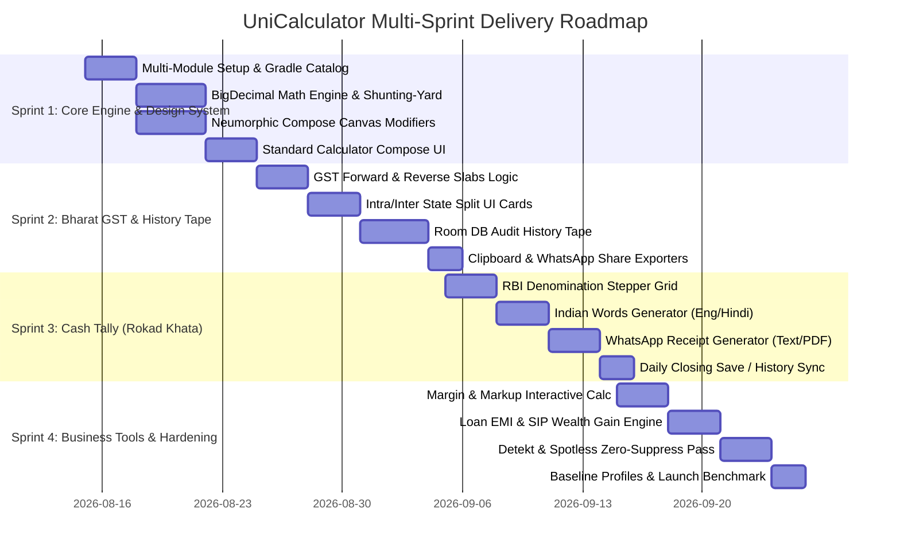

# 💻 20. DEVELOPMENT ROADMAP & SPRINT PHASING
**Project**: UniCalculator (Bharat Pro Financial & GST Neumorphic Calculator)

---

## 1. Phased Sprint Roadmap

```mermaid
gantt
    title UniCalculator Multi-Sprint Delivery Roadmap
    dateFormat  YYYY-MM-DD
    section Sprint 1: Core Engine & Design System
    Multi-Module Setup & Gradle Catalog   :a1, 2026-08-15, 3d
    BigDecimal Math Engine & Shunting-Yard :a2, after a1, 4d
    Neumorphic Compose Canvas Modifiers    :a3, after a1, 4d
    Standard Calculator Compose UI         :a4, after a2, 3d

    section Sprint 2: Bharat GST & History Tape
    GST Forward & Reverse Slabs Logic     :b1, 2026-08-25, 3d
    Intra/Inter State Split UI Cards      :b2, after b1, 3d
    Room DB Audit History Tape            :b3, after b2, 4d
    Clipboard & WhatsApp Share Exporters  :b4, after b3, 2d

    section Sprint 3: Cash Tally (Rokad Khata)
    RBI Denomination Stepper Grid         :c1, 2026-09-05, 3d
    Indian Words Generator (Eng/Hindi)    :c2, after c1, 3d
    WhatsApp Receipt Generator (Text/PDF) :c3, after c2, 3d
    Daily Closing Save / History Sync     :c4, after c3, 2d

    section Sprint 4: Business Tools & Hardening
    Margin & Markup Interactive Calc      :d1, 2026-09-15, 3d
    Loan EMI & SIP Wealth Gain Engine     :d2, after d1, 3d
    Detekt & Spotless Zero-Suppress Pass  :d3, after d2, 3d
    Baseline Profiles & Launch Benchmark  :d4, after d3, 2d
```
