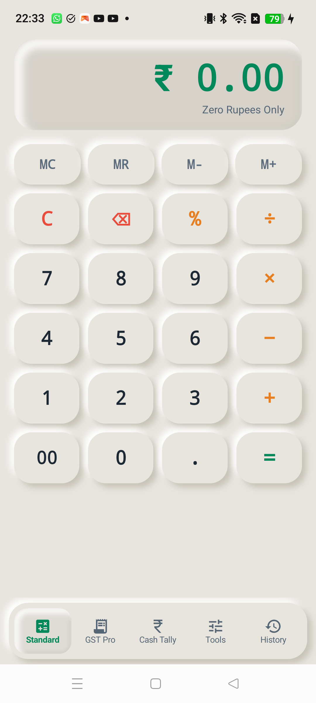
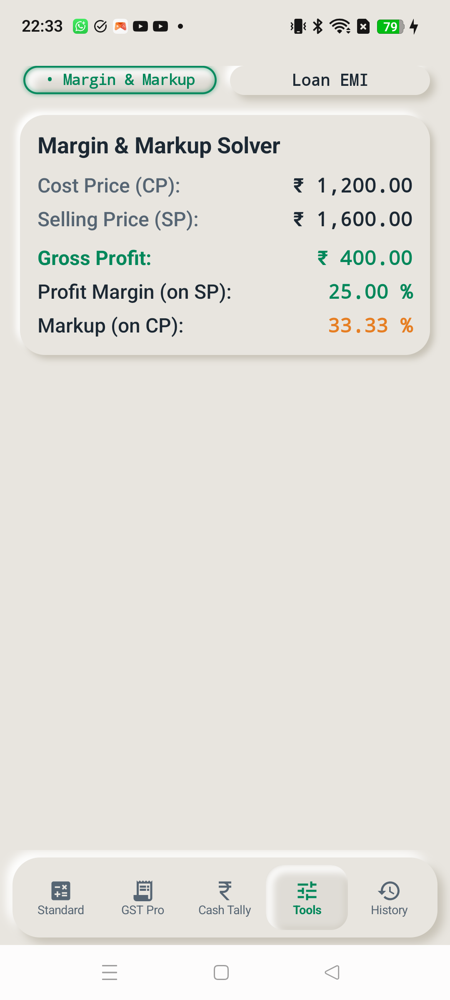
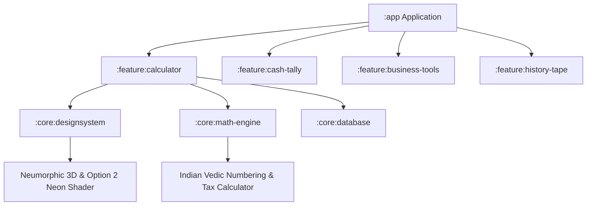

# 00. Current Progress & Engineering Overview

## 📌 Executive Summary
**UniCalculator** is an ultra-tactile Neumorphic commercial computation platform designed specifically for Indian businesses, retail shopkeepers, CA professionals, and enterprise traders. Built on Kotlin Multi-Module Clean Architecture with 100% Jetpack Compose.

---

## 📱 Live Screen Status & Visual Matrix

| Module | Screen Key | Primary Utility | Live Hardware Verification |
|---|---|---|---|
| **Standard** | `Tab 0` | Everyday arithmetic & high-speed cashier entry |  |
| **GST Pro (+GST)** | `Tab 1` | Forward statutory tax computation & multi-qty math |  |
| **GST Pro (−GST)** | `Tab 1` | Reverse tax deconstruction & Inter-state IGST |  |
| **Cash Tally** | `Tab 2` | Bank denomination counter & cash closing summary |  |
| **Business Tools**| `Tab 3` | Retail profit margin, markup & EMI calculations |  |
| **History Tape** | `Tab 4` | Audit roll, transaction logs & invoice export |  |

---

## 🏛️ System Architecture

---

## ⚡ Key Milestone Achievements (v1.0.0-rc12)
1. **Option 2 Perimeter Neon Ring**: Dual-pass hardware-accelerated laser underglow rim on active buttons and slab pills.
2. **Dual Neumorphic Slidable Switches**: Spring-animated 2-state toggle switches (`[+GST ⇄ −GST]` and `[CGST+SGST ⇄ IGST]`).
3. **Master Receipt Display at Top**: Relocated unified receipt/display card to top viewport position with grand typography.
4. **Multi-Line In-Words Micro-Plate**: Formal banking transcription (`IN WORDS: ...`) wrapped cleanly across 2 lines without truncation.
5. **Inline Quantity & Unit Rate Arithmetic**: Live expression evaluator for `÷` and `×` keys on GST Pro numpad.
