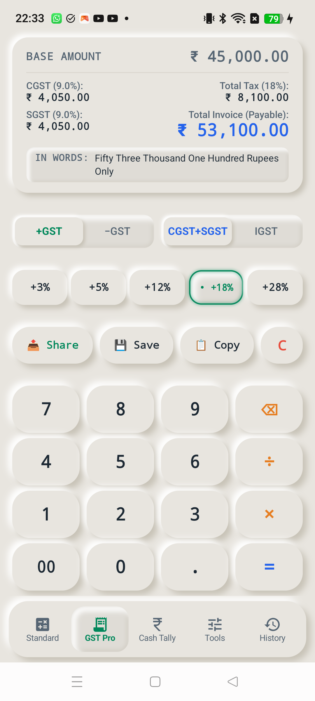
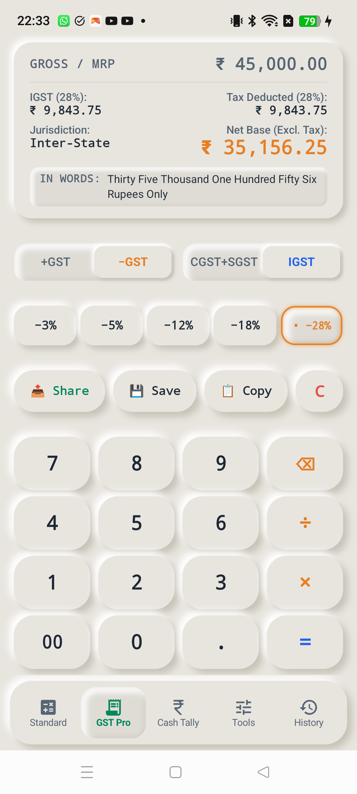

# 02. Screen: GST Pro Commercial Calculator

## 🎯 Purpose & Utility
**GST Pro** is the core commercial powerhouse of UniCalculator. Tailored for Indian GST compliances, it computes statutory tax splits, reverse inclusive-to-exclusive base extractions, and multi-quantity product rates on the fly.

---

## 📱 Live Physical Hardware Snapshots

### State A: Forward Mode (+GST Intra-State, 18% Slab)

### State B: Reverse Mode (−GST Inter-State, 28% Luxury Slab)

---

## 📐 Layout Architecture & Controls

### 1. Unified Master Receipt Display Card (Top)
- **Header Line**: Base / MRP Amount (`17sp Bold Monospace`).
- **Statutory Tax Column (Left)**:
  - Intra-State: `CGST (rate/2)` & `SGST (rate/2)`
  - Inter-State: `IGST (full rate)` & `Jurisdiction: Inter-State`
- **Commercial Totals Column (Right)**:
  - Forward: `Total Tax` + `Total Invoice (Payable)` in **Electric Sapphire Blue** (`#2563EB`).
  - Reverse: `Tax Deducted` + `Net Base (Excl. Tax)` in **Gst Saffron Amber** (`#D97706`).
- **Recessed In-Words Micro-Plate**:
  - `IN WORDS: <Full Amount In Words>` wrapped across 2 lines with zero truncation.

### 2. Dual Slidable Switches Row (38dp Height)
- **Left Switch**: `[ +GST (Emerald) ⇄ −GST (Amber) ]`
- **Right Switch**: `[ CGST+SGST ⇄ IGST (Sapphire Blue) ]`
- Smooth spring physics (`dampingRatio = 0.8f`) with recessed concave tracks and raised 3D floating thumbs.

### 3. GST Slabs Row with Option 2 Perimeter Neon Ring
- Slabs: `3%, 5%, 12%, 18%, 28%`
- Unselected: Raised 3D Convex Cushion (`5dp elevation`).
- Selected: Deep Concave Well (`4dp elevation`) with **Option 2 Dual-Pass Perimeter Neon Ring** (`• +18%` in Emerald Green, `• +28%` in Saffron Amber).

### 4. Commercial Action Bar
- `[ 📤 Share ]`: WhatsApp and invoice summary text generator.
- `[ 💾 Save ]`: Persists calculation to History Audit Tape.
- `[ 📋 Copy ]`: Copies structured breakdown to system clipboard.
- `[ C ]`: Instantly clears input and resets display.

### 5. Multi-Quantity 4-Row Numpad
- Includes `÷` (Per-unit price split) and `×` (Quantity rate multiplier).
