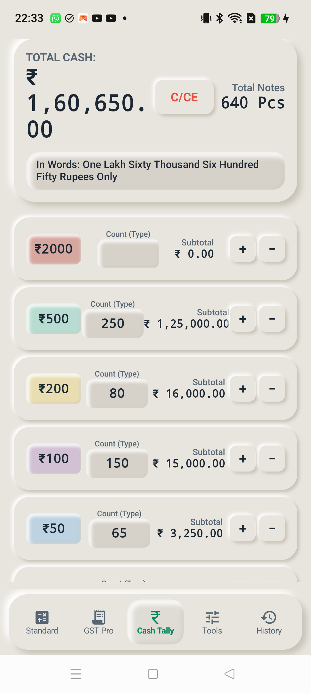

# 03. Screen: Cash Tally (Denomination Counter)

## 🎯 Purpose & Utility
**Cash Tally** replaces physical bank deposit slip calculations and cash drawer balancing. Shopkeepers and cashiers can rapidly count currency notes across all Indian RBI denominations with instant subtotal and grand total aggregation.

---

## 📱 Live Physical Hardware Snapshot

---

## 💵 Denomination Matrix & Bundle Counter
Supports all active and legal Indian currency notes:
- **₹ 2,000** (Pink / Magenta badge)
- **₹ 500** (Emerald / Stone Green badge)
- **₹ 200** (Bright Saffron Yellow badge)
- **₹ 100** (Lavender / Soft Purple badge)
- **₹ 50** (Cyan / Aqua Blue badge)
- **₹ 20** (Warm Orange / Ochre badge)
- **₹ 10** (Chocolate Brown badge)

---

## 🎛️ Interactive Controls
1. **Master Grand Total Header**:
   - Displays live total cash (`₹ 1,60,650.00`) and total physical notes count (`640 Pcs`).
   - Live In-Words transcription (`One Lakh Sixty Thousand Six Hundred Fifty Rupees Only`).
   - `[ C/CE ]` reset button.
2. **Denomination Rows**:
   - Recessed count input box (`NeumorphicShape.CONCAVE`).
   - Increment `[ + ]` and Decrement `[ − ]` quick stepper buttons.
   - Dynamic live subtotal for each note type.
