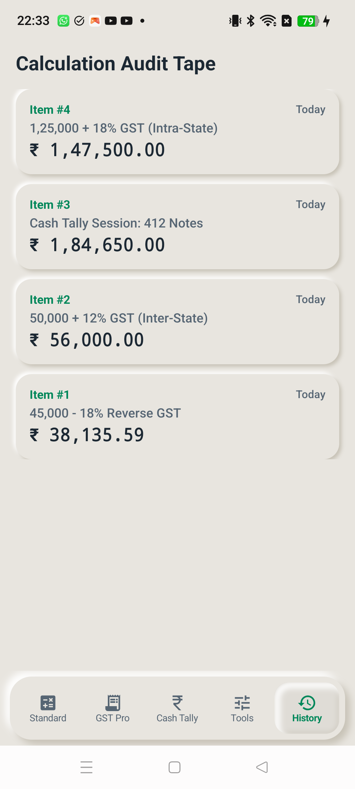

# 05. Screen: Calculation Audit History Tape

## 🎯 Purpose & Utility
The **History Tape** acts as an electronic endless paper roll that automatically records every calculation across Standard Calc, GST Pro, and Cash Tally sessions with audit-trail timestamps.

---

## 📱 Live Physical Hardware Snapshot

---

## 📜 Audit Card Structure
Every tape entry is stored locally in Room SQL database and presented in a raised Neumorphic card (`NeumorphicShape.CONVEX`):
- **Item Header**: Item index (`Item #4`) and timestamp (`Today`, `Yesterday`, or formatted date).
- **Transaction Line**: Expression and mode (e.g. `1,25,000 + 18% GST (Intra-State)` or `Cash Tally Session: 412 Notes`).
- **Final Result Amount**: Grand total in bold currency typography (`₹ 1,47,500.00`).

---

## 🔒 Privacy & Offline Security
- 100% Local-First on-device storage.
- Zero analytics or cloud tracking of sensitive commercial numbers.
