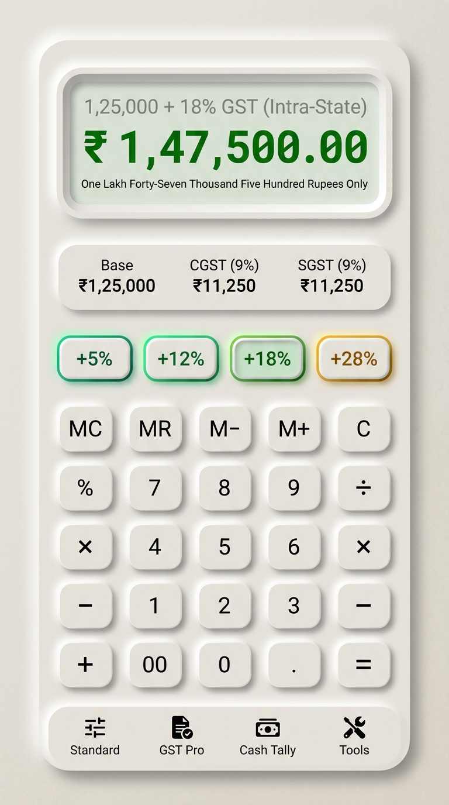
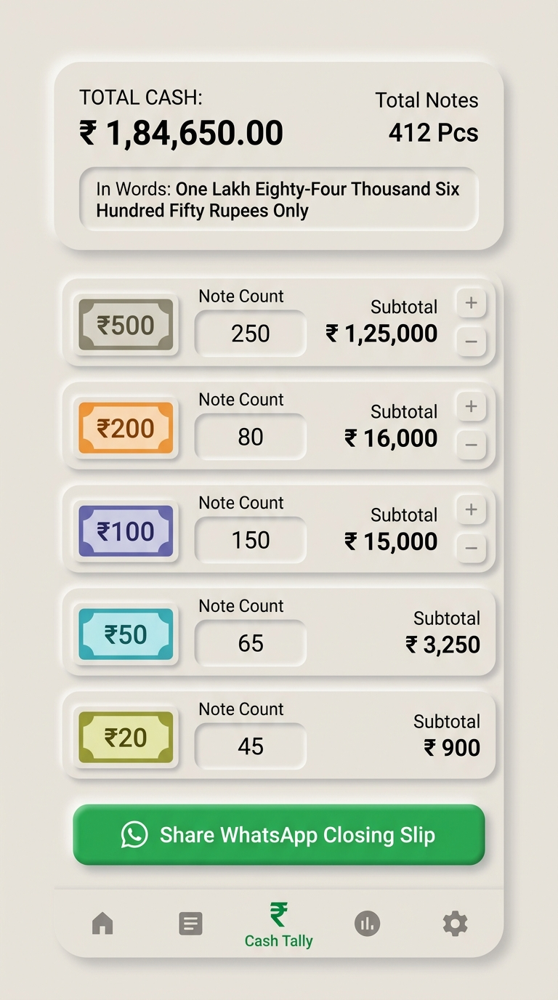

# 📱 UniCalculator Bharat — The Tactile Neumorphic Financial Workstation
### *Calculate • Simplify • Grow — 100% Offline-First Commercial Math & GST Engine for Bharat*

<p align="center">
  
</p>

<p align="center">
  <a href="#-the-5-core-workstations"></a>
  <a href="#-architecture"></a>
  <a href="#-precision"></a>
  <a href="#-privacy"></a>
  <a href="#-platform"></a>
</p>

---

## 🌟 Executive Overview & The Bharat Vision

**UniCalculator Bharat** is a flagship, professional Android financial calculator engineered specifically for Indian Kirana store owners, wholesale traders, Chartered Accountants (CAs), tax practitioners, small business merchants, and daily shoppers.

Combining the satisfying physical keystroke feel of classic Japanese & Citizen desktop commercial calculators with a **Pure Advanced Neumorphism UI (Soft 3D Tactile Design)** and **Skia 360° Neon Glow Typography**, UniCalculator delivers:
1. **Instant Indian GST Slabs & Reverse GST Engine** (Extract base price from MRP in 1 tap with 50/50 CGST+SGST or IGST tax splits).
2. **Cash Denomination Ledger (रोकड़ खाता)** from **₹2000 down to ₹1 notes + coins** with instant English & Hindi **Number-to-Words translation in Lakhs & Crores** and 1-tap WhatsApp closing slips.
3. **16 Traditional & Business Tools** (Tola/Ratti gold jewelry units, Bigha/Guntha land units, Loan EMI, Margin/Markup, and Live 2-way currency exchange rate sync).
4. **Physical Sliding Active Pill Navigation**: A unified bottom navigation rail with fluid liquid spring physics and zero screen jitter.
5. **100% Offline-First Privacy**: Zero tracking, zero ads, zero telemetry, local SQLite WAL database, and sub-60ms instant cold launch.

---

## 📸 Live Hardware Showcase (Realme RMX3998)

| 🧮 Standard Calculator (Emerald Glow) | 🧾 GST Pro Master Screen (+GST & −GST) |
| :---: | :---: |
|  |  |
| *Recessed LCD Well + Skia Neon Matrix Digits* | *Unified Master LCD + Live CGST/SGST Breakdown* |

| 💵 Cash Denomination Tally (रोकड़ खाता) | 🌙 Cyber Dark Obsidian OLED Theme |
| :---: | :---: |
|  |  |
| *3-Well Master HUD + RBI Notes (₹500 to ₹1)* | *Obsidian Slate + Multi-Color Neon LED Glow* |

---

## ⚡ The 5 Core Workstations

### 1. 🧮 Standard Commercial Calculator
- **Casio / Citizen Class Precision**: Strict `java.math.BigDecimal` pipeline preventing floating-point precision loss (`0.1 + 0.2` never equals `0.30000000000000004`).
- **Commercial Percentage Logic**: Citizen desktop standard `100 - 10% = 90` and `100 + 10% = 110`.
- **Repeated Equals (`=`)**: Repeated execution of last operator and operand (e.g. `10 + 2 = 12`, `= 14`, `= 16`).
- **Operator Override & Chaining**: Seamlessly replace operators in real-time without clearing expression history.
- **Universal In-Place Cursor Editing**: Full touch selection and cursor repositioning with zero Android IME software keyboard interference.

### 2. 🧾 GST Pro Invoicing Engine
- **1-Tap Slabs**: Dedicated tactile buttons for `+5%`, `+12%`, `+18%`, `+28%` and `-5%`, `-12%`, `-18%`, `-28%` (Reverse GST).
- **Reverse GST Base Extraction**: Eliminates the complex manual `Base = Total / (1 + Rate/100)` formula.
- **Jurisdiction Live Split**:
  - **Intra-State (Default)**: 50% CGST + 50% SGST (with odd-paise exact integer split).
  - **Inter-State**: 100% IGST.
- **Special Bharat Slabs**: Preset chips for **3% (Gold & Jewellery)** and **0.25% (Cut & Polished Diamonds)**.
- **Cheque In-Words Engine**: Live English & Devanagari Hindi text conversion in Lakhs & Crores.

### 3. 💵 Cash Denomination Ledger (रोकड़ खाता / Cash Tally)
- **Full RBI Currency Spectrum**:
  - High/Standard Notes: **₹500, ₹200, ₹100, ₹50, ₹20, ₹10, ₹5, ₹2, ₹1**
  - Granular Coins Counter: ₹20, ₹10, ₹5, ₹2, ₹1 Coins.
- **3-Well Master HUD**: Live Total Cash, Total Notes count, and Total Coins count.
- **Packet & Bundle Math**: 100 notes = 1 Packet, 10 Packets = 1 Bundle/Brick (1000 notes).
- **1-Tap WhatsApp Closing Slip**: Formats and shares daily cash closing summaries instantly.

### 4. 🎛️ 16 Business & Traditional Indian Tools
- **Traditional Indian Unit Converters**:
  - **Gold & Jewellery**: Tola, Ratti, Masha, Grams, Sovereigns.
  - **Land & Agriculture**: Bigha, Guntha, Ground, Cent, Acre, Square Yards.
  - **Mandi & Weight**: Quintal, Metric Ton, Kilogram, Maund.
- **Financial Tools**:
  - **Loan & EMI Calculator**: Reducing Balance vs. Flat Rate EMI comparisons.
  - **Margin & Markup Engine**: Profit margin calculation for wholesale and retail pricing.
  - **Multi-Tier Discount Calculator**: Successive discounts (`50% + 20%`) vs flat discounts.
- **Live 2-Way Currency Exchange Converter**: Real-time multi-currency conversion with automatic fallback.

### 5. 🕒 Smart History Audit Tape
- **Isolated Module Filters**: Dedicated tabs for Standard Math, GST Pro Invoices, Cash Tally Sessions, and Business Tools.
- **Persistence**: Local SQLite WAL database with instant search and statement export.

---

## 🎨 Advanced Neumorphism & Physics Architecture

### 1. 🌓 Skia Path Difference Inverted Lighting Model
```
┌─────────────────────────────────────────────────────────────┐
│  Light Source (-45° Top-Left) ──► Casts Deep Inner Shadow   │
│  [ Sunken LCD Well ] ──► PathOperation.Difference (0% Bleed)│
│  Bottom-Right Inner Rim ──► Catches Light Highlight Bevel   │
└─────────────────────────────────────────────────────────────┘
```
Unlike standard blur filters that wash out recessed wells, UniCalculator uses Skia `PathOperation.Difference` to invert shadow clipping paths. This guarantees 100% razor-sharp inner depth on recessed LCD wells without outer shadow bleed.

### 2. 💡 Skia 360° Neon Glow Typography Engine
Utilizing Skia GPU text-blur with zero spatial displacement (`Offset.Zero`) and high-radius photon bloom (`blurRadius = 12f - 20f`), calculated digits radiate a vibrant VFD/LED matrix glow:
- 🟢 **Emerald Green Neon Glow (`#00C781`)**: Standard calculation & Total Cash.
- 🟠 **Saffron Amber Neon Glow (`#E67E22`)**: Reverse GST extraction & discount savings.
- 🔵 **Cyan Sapphire Neon Glow (`#0284C7`)**: Statutory CGST/SGST tax metrics.

### 3. 🌊 Liquid Spring Continuous Sliding Bottom Navigation
A dedicated physical active capsule glides smoothly across the bottom rail using `FastOutSlowInEasing` (420ms duration) with subtle liquid stretch physics and arrival micro-scale pops, keeping screen contents perfectly stable.

---

## 🏛️ Clean Architecture & Multi-Module Structure

```
UniCalculator/
├── app/                  # Application entry point, theme wiring, main scaffold
├── core/
│   ├── common/           # SharedPreferences, Vedic formatters, Indian currency
│   ├── database/         # Room SQLite WAL entities, DAOs, repository
│   ├── designsystem/     # Neumorphic modifiers, buttons, LCD wells, Neon glow, sliding nav
│   ├── math-engine/      # Shunting-yard evaluator, GST engine, commercial engines
│   └── model/            # Immutable domain models and calculation enums
└── feature/
    ├── business-tools/   # 16 Converters, Loan EMI, Margin, Discount
    ├── calculator/       # Standard Calculator & GST Pro screens + About sheet
    ├── cash-tally/       # Cash denomination tally & closing slip exporter
    └── history-tape/     # Unified audit tape & statement search
```

---

## 🛠️ Build & Installation

### Prerequisites:
- Android Studio Ladybug (2024.2.1+) or newer
- JDK 21
- Android SDK 35 (Min SDK 26)

### Compile & Test:
```bash
# Run complete unit test suite
./gradlew testDebugUnitTest

# Assemble debug APK
./gradlew :app:assembleDebug

# Install directly to connected device
adb install -r app/build/outputs/apk/debug/app-debug.apk
```

---

## 👥 Creator & Architect

**Shoeb Ahmad**  
*Principal Architect & Founder*  
**UniAi Innovations**  

*Designed with mathematical rigor and passion for the merchants and people of Bharat.* 🇮🇳

---

## 📜 License

```
Copyright 2026 UniAi Innovations (Shoeb Ahmad)

Licensed under the Apache License, Version 2.0 (the "License");
you may not use this file except in compliance with the License.
You may obtain a copy of the License at

    http://www.apache.org/licenses/LICENSE-2.0
```
