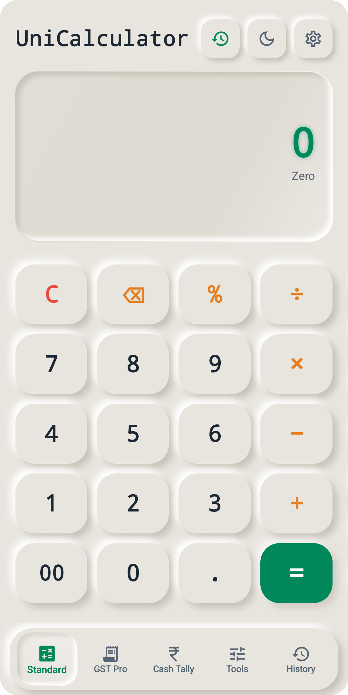
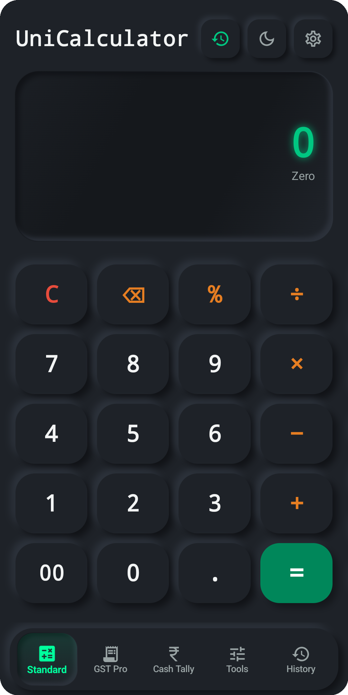
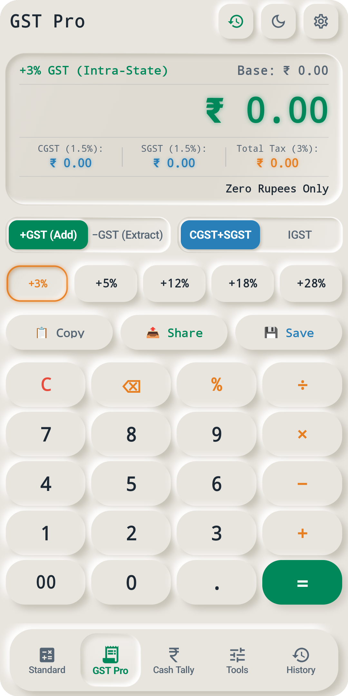
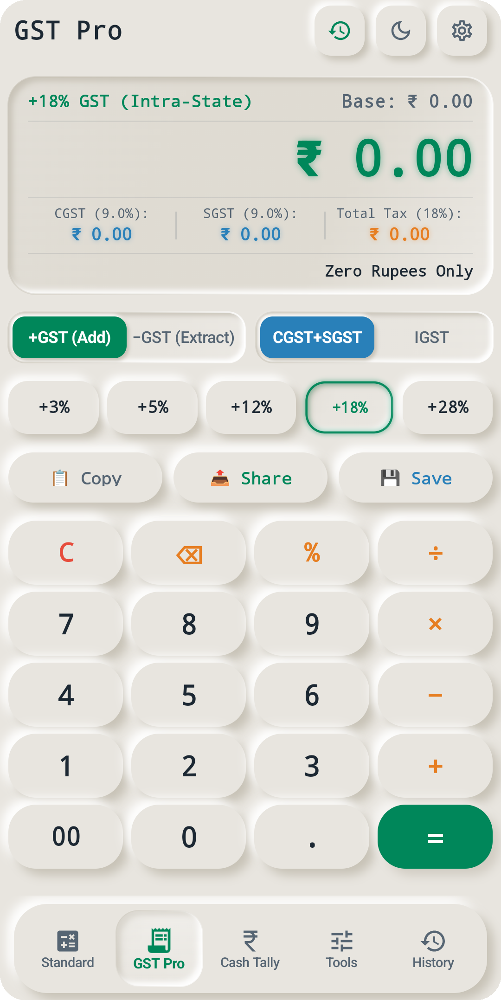
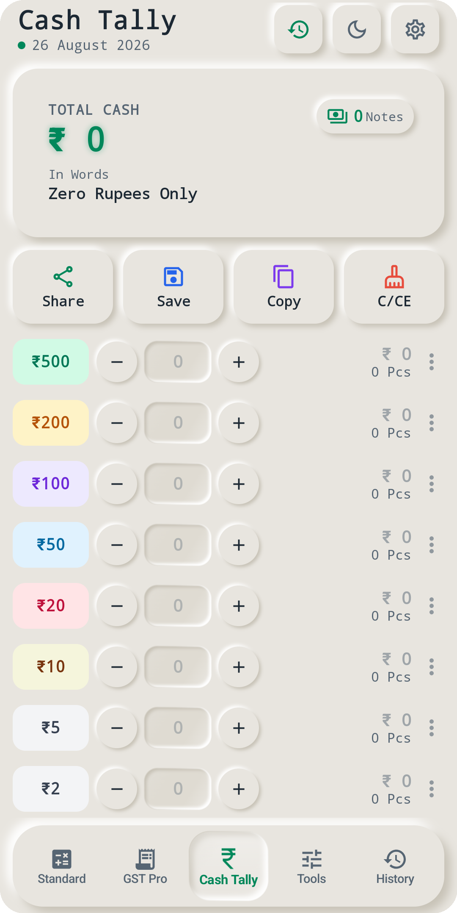
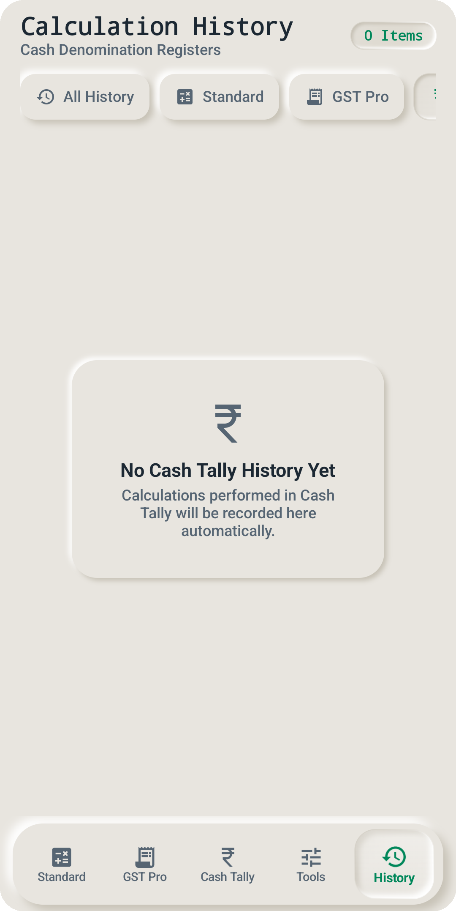
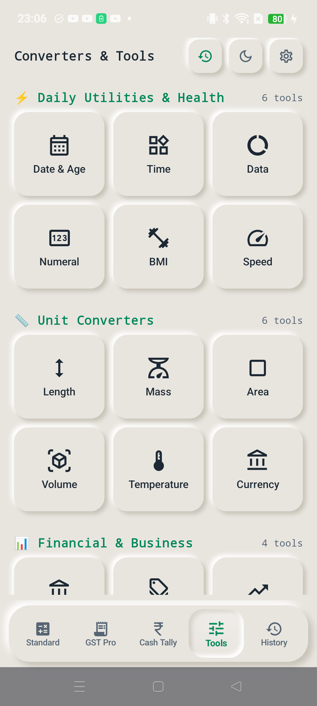
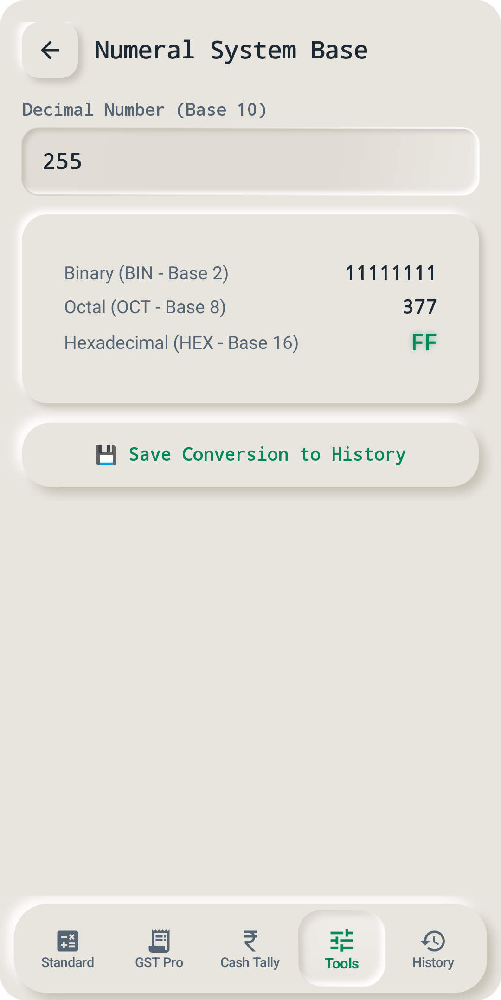
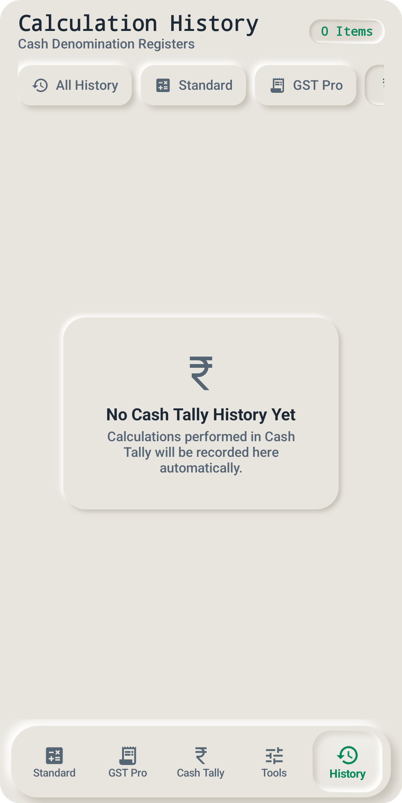

# 📱 UniCalculator — The Tactile Neumorphic Financial Workstation
### *Calculate • Simplify • Grow — 100% Offline-First Commercial Math & GST Engine for Bharat & Global Commerce*

<p align="center">
  
  &nbsp;&nbsp;&nbsp;&nbsp;
  
</p>

<p align="center">
  <a href="#-the-5-core-workstations"></a>
  <a href="#-architecture"></a>
  <a href="#-precision"></a>
  <a href="#-privacy"></a>
  <a href="#-platform"></a>
  <a href="#-license"></a>
</p>

---

## 🌟 Executive Overview & The Bharat Vision

**UniCalculator** is a flagship, professional Android financial calculator engineered specifically for Indian Kirana store owners, wholesale traders, Chartered Accountants (CAs), tax practitioners, small business merchants, and daily shoppers.

Combining the satisfying physical keystroke feel of classic Japanese desktop commercial calculators (Casio & Citizen) with a **Pure Advanced Neumorphism UI (Soft 3D Tactile Design)** and **Skia 360° Neon Glow Typography**, UniCalculator delivers:
1. **Instant Indian GST Slabs & Reverse GST Engine**: Extract base price from MRP in 1 tap with exact 50/50 CGST+SGST or IGST tax splits.
2. **Cash Denomination Ledger (रोकड़ खाता)**: From **₹2000 down to ₹1 notes + coins** with instant English & Hindi **Number-to-Words transcription in Lakhs & Crores** and 1-tap WhatsApp closing slips.
3. **Multi-Lingual In-Words Engine**: Configurable across **English, Hindi (Devanagari), Dual (Both), and Off** with pure mathematical wording for standard calculations.
4. **16 Traditional & Business Tools**: Tola/Ratti gold jewelry units, Bigha/Guntha land units, Loan EMI, Margin/Markup, and Live 2-way currency exchange rate sync.
5. **Physical Sliding Active Capsule Navigation**: Fluid liquid spring physics and zero screen jitter across all 5 workstations.
6. **100% Offline-First Privacy**: Zero tracking, zero ads, zero telemetry, local SQLite WAL database, and sub-60ms instant cold launch.

---

## 📸 Live Hardware Showcase (Realme RMX3998 • Android 14)

### 🧮 Workstation 1: Standard Commercial Calculator
| ☀️ Light Neumorphic (Zero State) | 🌙 Obsidian OLED Dark (Zero State • Neon Glow) |
| :---: | :---: |
|  |  |
| *Recessed LCD Well • Clean Resting State (`0` / `Zero`)* | *Obsidian Slate • Skia Neon Emerald Matrix Zero Digits* |

---

### 🧾 Workstation 2: GST Pro Invoicing Engine
| 🟢 Forward GST (+18% Intra-State) | 🟠 Reverse GST Base Extraction (-28% Inter-State) |
| :---: | :---: |
|  |  |
| *Unified Master LCD • 50/50 CGST & SGST Split* | *1-Tap MRP Base Extraction • Cheque In-Words Slip* |

---

### 💵 Workstation 3: Cash Denomination Ledger (रोकड़ खाता)
| ☀️ 3-Well Master HUD (Zero State) | 🌙 High-Contrast Cash Tally (Dark Mode) |
| :---: | :---: |
|  |  |
| *Clean Reset State • Total ₹0, 0 Notes • ₹500 to ₹1* | *OLED Dark Theme • Tactile Multi-Color Note Pills* |

---

### 🎛️ Workstation 4 & 5: Business Tools & History Audit Tape
| 📊 16-Tool Categorized Super Hub | 🏦 Interactive Loan & EMI Solver | 📜 Segregated Multi-Tab Audit Tape |
| :---: | :---: | :---: |
|  |  |  |
| *Daily Utilities, Indian Converters & Finance* | *Interactive Concave Sliders & Amortization* | *Per-Screen Isolated SQLite WAL Ledger* |

---

### 👑 Tactile Pro Subscription Suite & Settings
| 🎁 30-Day Free Trial & Pro Plans | ⚙️ Result In-Words Language Setting |
| :---: | :---: |
|  |  |
| *Anti-Clock-Tampering • Monthly, Annual & Lifetime Pro* | *[ English \| Hindi \| Both \| Off ] Tactile Pills* |

---

## ⚡ The 5 Core Workstations Breakdown

### 1. 🧮 Standard Commercial Calculator
- **Casio & Citizen Precision**: Strict `java.math.BigDecimal` arithmetic preventing IEEE-754 binary floating-point errors (`0.1 + 0.2` never equals `0.30000000000000004`).
- **Commercial Percentage Logic**: Citizen desktop standard `100 - 10% = 90` and `100 + 10% = 110`.
- **Repeated Equals (`=`)**: Constant arithmetic chaining (e.g. `10 + 2 = 12`, `= 14`, `= 16`).
- **Operator Override & Chaining**: Seamlessly replace operators in real-time without clearing expression history (`5 + * 2` cleanly becomes `5 * 2`).
- **Universal In-Place Cursor Editing**: Full touch selection and cursor positioning with zero Android soft keyboard interference.
- **Pure Math Number Words Engine**:
  - `100` ➔ `"One Hundred"` (EN) / `"एक सौ"` (HI) / `"One Hundred • एक सौ"` (Both)
  - `100.50` ➔ `"One Hundred Point Fifty"` (EN) / `"एक सौ दशमलव पचास"` (HI)
  - Zero / Negative numbers handled cleanly with zero hardcoded "Rupees" in pure math mode.

### 2. 🧾 GST Pro Invoicing Engine
- **1-Tap Slabs**: Dedicated tactile buttons for `+3%`, `+5%`, `+12%`, `+18%`, `+28%` and `-3%`, `-5%`, `-12%`, `-18%`, `-28%` (Reverse GST).
- **Reverse GST Base Extraction**: Eliminates the manual `Base = Total / (1 + Rate/100)` calculation in 1 tap.
- **Jurisdiction Live Split**:
  - **Intra-State (Default)**: 50% CGST + 50% SGST (with odd-paise exact integer split).
  - **Inter-State**: 100% IGST.
- **Special Bharat Slabs**: Preset chips for **3% (Gold & Jewellery)** and **0.25% (Cut & Polished Diamonds)**.
- **Cheque In-Words Engine**: Live English & Devanagari Hindi text conversion in Lakhs & Crores.

### 3. 💵 Cash Denomination Ledger (रोकड़ खाता / Cash Tally)
- **Full RBI Currency Spectrum**:
  - High/Standard Notes: **₹500, ₹200, ₹100, ₹50, ₹20, ₹10, ₹5, ₹2, ₹1**
  - Granular Coins Counter: ₹20, ₹10, ₹5, ₹2, ₹1 Coins.
- **3-Well Master HUD**: Live Total Cash, Total Notes count, and Total Coins count.
- **Packet & Bundle Math**: 100 notes = 1 Packet, 10 Packets = 1 Bundle/Brick (1000 notes).
- **1-Tap WhatsApp Closing Slip**: Formats and shares daily cash closing summaries instantly.

### 4. 🎛️ 16 Business & Traditional Indian Tools
- **Traditional Indian Unit Converters**:
  - **Gold & Jewellery**: Tola, Ratti, Masha, Grams, Sovereigns.
  - **Land & Agriculture**: Bigha, Guntha, Ground, Cent, Acre, Square Yards.
  - **Mandi & Weight**: Quintal, Metric Ton, Kilogram, Maund.
- **Financial Tools**:
  - **Loan & EMI Calculator**: Reducing Balance vs. Flat Rate EMI comparisons with interactive tenure presets.
  - **Margin & Markup Engine**: Real-time profit margin and markup solver for wholesale and retail pricing.
  - **Multi-Tier Discount Calculator**: Successive discounts (`50% + 20%`) vs flat discounts.
- **Live 2-Way Currency Exchange Converter**: Real-time multi-currency conversion with automatic fallback.

### 5. 📜 Smart History Audit Tape
- **Isolated Module Filters**: Dedicated tabs for Standard Math, GST Pro Invoices, Cash Tally Sessions, and Business Tools.
- **Persistence**: Local SQLite WAL database with instant search and statement export.

---

## 🎨 Advanced Neumorphism & Physics Architecture

### 1. 🌓 Skia Path Difference Inverted Lighting Model
```
┌─────────────────────────────────────────────────────────────┐
│  Light Source (-45° Top-Left) ──► Casts Deep Inner Shadow   │
│  [ Sunken LCD Well ] ──► PathOperation.Difference (0% Bleed)│
│  Bottom-Right Inner Rim ──► Catches Light Highlight Bevel   │
└─────────────────────────────────────────────────────────────┘
```
Unlike standard blur filters that wash out recessed wells, UniCalculator uses Skia `PathOperation.Difference` to invert shadow clipping paths. This guarantees 100% razor-sharp inner depth on recessed LCD wells without outer shadow bleed.

### 2. 💡 Skia 360° Neon Glow Typography Engine
Utilizing Skia GPU text-blur with zero spatial displacement (`Offset.Zero`) and high-radius photon bloom (`blurRadius = 12f - 20f`), calculated digits radiate a vibrant VFD/LED matrix glow:
- 🟢 **Emerald Green Neon Glow (`#00C781`)**: Standard calculation & Total Cash.
- 🟠 **Saffron Amber Neon Glow (`#E67E22`)**: Reverse GST extraction & discount savings.
- 🔵 **Cyan Sapphire Neon Glow (`#0284C7`)**: Statutory CGST/SGST tax metrics.

### 3. 🌊 Liquid Spring Continuous Sliding Bottom Navigation
A dedicated physical active capsule glides smoothly across the bottom rail using `FastOutSlowInEasing` (420ms duration) with subtle liquid stretch physics and arrival micro-scale pops, keeping screen contents perfectly stable.

---

## 👑 Commercial Pro Suite & Free Trial Policy

UniCalculator follows an ethical, merchant-first pricing model:
- **🎁 30-Day 100% Free Full-Access Trial**: Every user enjoys unrestricted, full access to all 5 workstations and 16 business tools for the first 30 days after install.
- **Anti-Clock-Tampering**: Built-in monotonic timestamp verification prevents trial extension via device date rollback.
- **💰 Nominal India-First Pro Plans**:
  - **Monthly Pro**: **₹29 / month** *(Flexible monthly billing)*
  - **Annual Pro ⭐ Best Value**: **₹199 / year** *(~₹16.50 / month • 45% Savings)*
  - **Lifetime Vyapar Pro 👑**: **₹499 One-Time** *(Pay once, own all workstations forever)*
- **🧮 Standard Calculator**: Remains **100% FREE FOREVER with ZERO ADS**.

---

## 🏛️ Multi-Module Architecture

```
UniCalculator/
├── app/                  # Application entry point, theme wiring, main scaffold, paywall
├── core/
│   ├── common/           # SharedPreferences, Vedic formatters, Indian currency word converter
│   ├── database/         # Room SQLite WAL entities, DAOs, repository
│   ├── designsystem/     # Neumorphic modifiers, buttons, LCD wells, Neon glow, sliding nav
│   ├── math-engine/      # Shunting-yard evaluator, GST engine, commercial engines, unit converter
│   └── model/            # Immutable domain models, subscription states, calculation enums
└── feature/
    ├── business-tools/   # 16 Converters, Loan EMI, Margin, Discount, Tools Settings
    ├── calculator/       # Standard Calculator & GST Pro screens + Settings + About sheet
    ├── cash-tally/       # Cash denomination tally & closing slip exporter
    └── history-tape/     # Unified multi-tab audit tape & statement search
```

---

## 🛠️ Build & Installation

### Prerequisites:
- Android Studio Ladybug (2024.2.1+) or newer
- JDK 21
- Android SDK 35 (Min SDK 26)

### Compile & Test:
```bash
# Run complete unit test suite (100% passing)
./gradlew testDebugUnitTest

# Assemble debug APK
./gradlew :app:assembleDebug

# Install directly to connected device
adb install -r app/build/outputs/apk/debug/app-debug.apk
```

---

## 👥 Creator & Publisher

**Published by**: **UniCore Technologies**  
**Support & Contact**: `theunicoretech@gmail.com`  
**Principal Architect & Lead Engineer**: **Shoeb Ahmad**  

*Designed with mathematical rigor and passion for the merchants and people of Bharat.* 🇮🇳

---

## 📜 License

```
Copyright 2026 UniCore Technologies (Shoeb Ahmad)

Licensed under the Apache License, Version 2.0 (the "License");
you may not use this file except in compliance with the License.
You may obtain a copy of the License at

    http://www.apache.org/licenses/LICENSE-2.0
```
